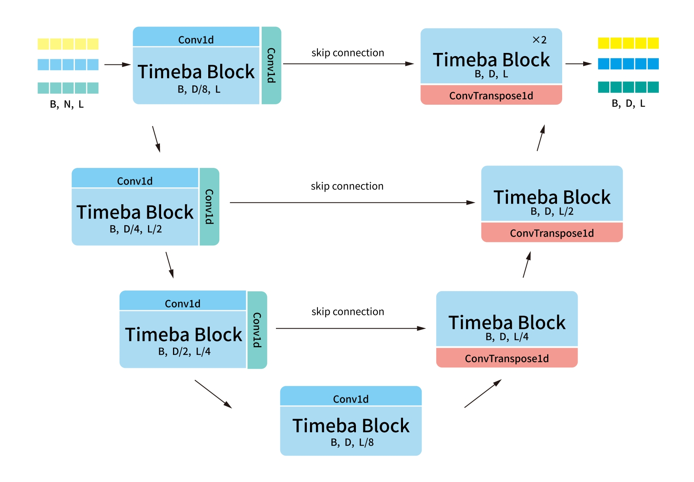

<h1 align="center">
Timeba
</h1>

<p align="center">
<strong>Temporal U-Shape Hierarchy with Selective State-Space Modeling for Trajectory Prediction</strong>
</p>

<p align="center">
<a href="https://www.researchsquare.com/article/rs-8501461/latest.pdf">Paper</a> ·
<a href="docs/INSTALL.md">Installation</a> ·
<a href="docs/DATA_FORMAT.md">Data Format</a> ·
<a href="docs/CONFIGURATION.md">Configuration</a>
</p>

<p align="center">


</p>


<p align="center">
  
</p>

## Overview

Timeba combines a temporal U-shaped hierarchy with selective state-space
(Mamba) blocks to model multiscale trajectory dynamics efficiently. The
canonical pipeline includes:

- a four-stage temporal hierarchy with top-down feature fusion;
- selective state-space modeling at multiple temporal resolutions;
- actor-interaction modeling and multimodal trajectory prediction;
- explicit dataset schemas and configurable feature selection;
- strict checkpoint loading and config-driven training and evaluation.

The public model API is intentionally small:

```python
from timeba import Timeba

model = Timeba(
    input_dim=resolved_features.input_dim,
    pred_len=experiment.pred_len,
    num_modes=experiment.num_modes,
)
```

`input_dim` is derived from the selected feature groups rather than fixed by
the dataset:

```text
DatasetSchema
  -> FeatureSpec
  -> ordered raw and derived channels
  -> input_dim
```

## Quick start

### 1. Installation

A tested environment uses Python 3.10, PyTorch 2.1.2 with CUDA 12.1,
`mamba-ssm==1.2.2`, and `causal-conv1d==1.2.2.post1`.

```bash
conda create -n timeba python=3.10 -y
conda activate timeba
```

Install a CUDA-compatible PyTorch and Mamba stack, then install the remaining
requirements. See the complete [installation guide](docs/INSTALL.md).

### 2. Prepare data

The canonical pipeline reads prepared per-scene CSV files:

```text
DATA_ROOT/
├── train/*.csv
├── val/*.csv
└── test/*.csv
```

The expected columns and scene layout are documented in
[DATA_FORMAT.md](docs/DATA_FORMAT.md).

### 3. Train

```bash
python -m scripts.train \
  --experiment ngsim_paper \
  --data-root /path/to/prepared/data \
  --output-dir /path/to/output
```

<details>
<summary>Resume an existing run</summary>

```bash
python -m scripts.train \
  --experiment ngsim_paper \
  --data-root /path/to/prepared/data \
  --output-dir /path/to/existing/run \
  --resume /path/to/existing/run/epoch_010.ckpt
```

Existing metric records in the output directory are validated and preserved.

</details>

### 4. Evaluate

```bash
python -m scripts.evaluate \
  --experiment ngsim_paper \
  --data-root /path/to/prepared/data \
  --checkpoint /path/to/checkpoint.ckpt \
  --split val \
  --output /path/to/metrics.json
```

Checkpoint loading is strict by default. Evaluation uses the prediction horizon
configured by each preset and reports the historical K=1 and K=6 semantics.

## Configurations

Ready-to-use configurations are provided for NGSIM, highD, and exiD:

- `ngsim`
- `highd`
- `exid`

Each configuration defines the dataset schema, selected feature groups,
sequence settings, and training schedule. The model input dimension is resolved
automatically from the selected features.

See [Data and sequence configuration](docs/CONFIGURATION.md)
for feature mappings and implementation details.

## Repository structure

```text
Timeba/
├── timeba/
│   ├── models/       # canonical Timeba architecture
│   ├── data/         # schemas, feature resolution, and datasets
│   ├── config/       # experiment definitions and presets
│   ├── engine/       # training, checkpointing, and evaluation pipeline
│   └── evaluation/   # trajectory metrics
├── scripts/          # public training and evaluation entrypoints
├── tests/            # unit, parity, compatibility, and integration tests
├── docs/             # installation, data, and implementation notes
└── assets/           # architecture figures
```

## Documentation

| Document | Description |
| --- | --- |
| [Installation](docs/INSTALL.md) | Tested CUDA, PyTorch, and Mamba setup |
| [Prepared data format](docs/DATA_FORMAT.md) | Required CSV layout and fields |
| [Data and sequence configuration](docs/CONFIGURATION.md) | Feature resolution, aligned sequence lengths, and LR notes |
| [Runtime equivalence](docs/RUNTIME_EQUIVALENCE.md) | Canonical-to-historical implementation certification |
| [Third-party notices](THIRD_PARTY_NOTICES.md) | Attribution and derived-code notices |

The canonical model was checked against the historical implementation, and the
config-driven pipeline is covered by synthetic transformation, forward,
backward, optimizer, checkpoint, and evaluation tests. Full paper metrics were
not rerun during repository cleanup.

## Citation

If you find Timeba useful in your research, please cite:

```bibtex
@article{wang2026timeba,
  title   = {Timeba: UNet State Space Model for Trajectory Prediction},
  author  = {Wang, Baoyun and He, Lei and Li, Zichong},
  journal = {Research Square},
  year    = {2026},
  doi     = {10.21203/rs.3.rs-8501461/v1},
  url     = {https://doi.org/10.21203/rs.3.rs-8501461/v1}
}
```

The final journal citation will be added after formal publication.

Timeba builds on the selective state-space modeling introduced in Mamba:

```bibtex
@article{gu2023mamba,
  title   = {Mamba: Linear-Time Sequence Modeling with Selective State Spaces},
  author  = {Gu, Albert and Dao, Tri},
  journal = {arXiv preprint arXiv:2312.00752},
  year    = {2023},
  doi     = {10.48550/arXiv.2312.00752},
  url     = {https://arxiv.org/abs/2312.00752}
}
```

## License and attribution

This repository is released under the included non-commercial
[LICENSE](LICENSE). Relevant source-file notices are preserved; see
[THIRD_PARTY_NOTICES.md](THIRD_PARTY_NOTICES.md) for details.